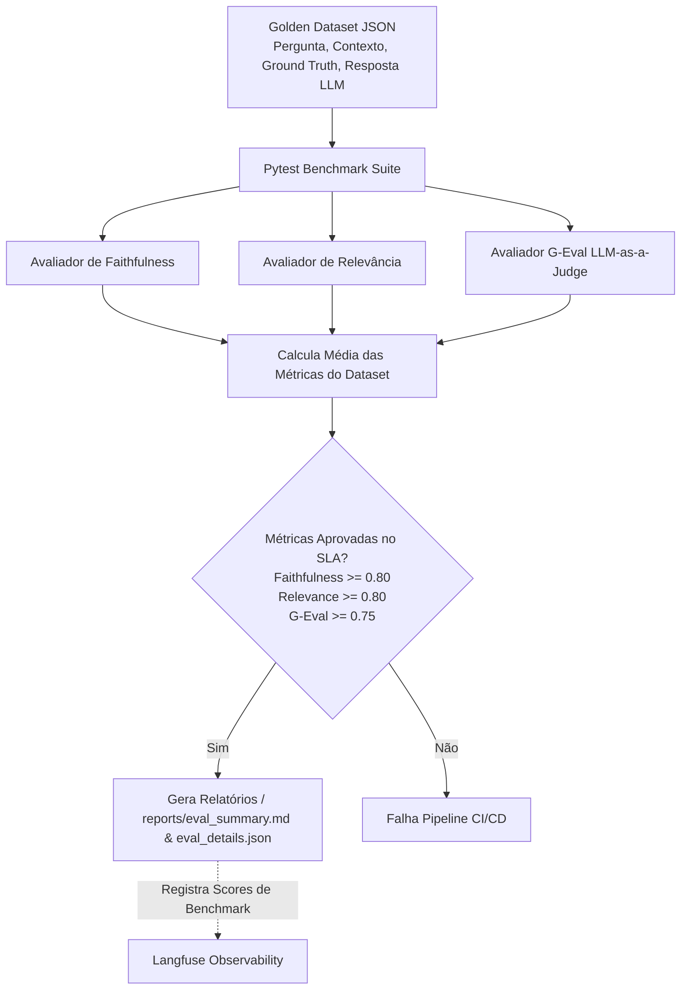

# LLM Offline Evaluation Suite & G-Eval Framework 📊🧪


> Framework de Avaliação Offline para LLMs com **Golden Dataset (Ground Truth)**, métricas de **Faithfulness (Fidedignidade)**, **Answer Relevance** e **G-Eval (LLM-as-a-Judge)** com Rastreamento no Langfuse e Relatórios Analíticos em Markdown/JSON.

---

## 🧭 Visão Geral

A **LLM Evaluation Suite** estabelece a cultura de testes automatizados de qualidade de IA offline (Continuous Evaluation & Quality Gates), garantindo que atualizações de modelos, prompts ou bases de conhecimento não causem regressão no comportamento do sistema.

---

## 🏗️ Métricas & Rúbricas de Avaliação

| Métrica | Algoritmo / Descrição | SLA Mínimo |
| :--- | :--- | :---: |
| **Faithfulness** | Avalia se a resposta gerada está estritamente fundamentada no contexto recuperado (evita alucinações de dados). | `≥ 0.80` |
| **Answer Relevance** | Avalia se a resposta atende diretamente à dúvida formulada pelo usuário sem rodeios. | `≥ 0.80` |
| **G-Eval (LLM-as-a-Judge)** | Avaliação multidimensional baseada em rúbricas (Corretude, Clareza, Tom e Conformidade corporativa). | `≥ 0.75` |

---

## 🔄 Fluxo do Pipeline de Avaliação Offline



---

## 🚀 Como Executar

### 1. Execução dos Testes e Avaliação em Docker
```bash
docker run --rm -e PYTHONPATH=/app -v $(pwd):/app -w /app python:3.12-slim bash -c "pip install pytest pytest-cov pydantic pydantic-settings langfuse && pytest --cov=app --cov-report=term-missing"
```

### 2. Execução Local
```bash
pip install -e .[dev]
make test
```

---

## 📄 Exemplo de Relatório Gerado (`reports/eval_summary.md`)

Após cada execução, um relatório é salvo automaticamente com a tabela comparativa:

```markdown
# Relatório Analítico de Avaliação de LLMs 📊

> Resultado Geral do Benchmark: 🟩 APROVADO

| Métrica | Média Obtida | SLA Mínimo | Status |
| :--- | :---: | :---: | :---: |
| Faithfulness | 0.95 | 0.80 | ✅ PASS |
| Answer Relevance | 0.90 | 0.80 | ✅ PASS |
| G-Eval | 0.88 | 0.75 | ✅ PASS |
```

---

## 🛡️ Licença & Autor
Desenvolvido por **Cayo Neves** ([@cayoesn](https://github.com/cayoesn)) como parte do Portfólio de LLM & LLMOps de Alta Performance.
